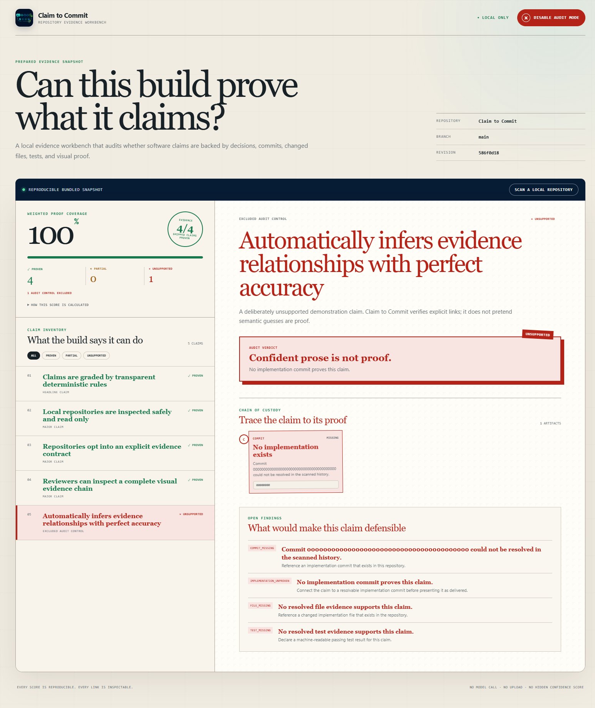

# Claim to Commit

> Every software claim should be traceable to evidence.

Claim to Commit is a local repository evidence workbench for engineering leads, hackathon reviewers, and teams reviewing AI-assisted software. It turns declared product claims into an inspectable chain of custody:

**human decision → Codex session → commit → changed file → passing test → visual proof**

The workbench never invents a relationship. It verifies the repository's explicit evidence contract, grades each claim as **proven**, **partial**, or **unsupported**, and explains exactly what is missing.


## The problem and the audience

AI coding agents can produce convincing prose, large diffs, and polished demos faster than a reviewer can validate them. An engineering lead still has to answer a harder question: *which claims are actually supported by a decision, attributable implementation, test result, and visible artifact?* Transcripts and diffs are useful, but neither gives a product-level chain of custody.

Claim to Commit is initially for:

- engineering leads reviewing agent-assisted pull requests;
- hackathon judges comparing claims with what was actually built; and
- small teams that need an auditable handoff without buying another hosted platform.

The novel move is to make product claims the unit of review. A claim is not green because it sounds plausible or because a model assigns confidence. It is green only when its required repository evidence resolves under public, deterministic rules.

## What it does

- Loads a zero-setup bundled audit immediately.
- Scans any local Git repository that opts in with `.claim-to-commit/evidence.json`.
- Resolves decisions, declared Codex sessions, commits, changed-file attribution, test artifacts, and screenshots.
- Uses read-only Git commands with argument arrays and rejects paths that escape the repository.
- Calculates a reproducible weighted proof score: headline claims weigh 3, major claims 2, and supporting claims 1.
- Reveals missing proof in **Audit Mode**, including an intentionally impressive but unsupported claim.
- Stores immutable scan results locally in SQLite; no repository content is uploaded.
- Audits its own Build Week repository with real decisions, dated commits, tests, and screenshots.



## Quick start — one command

Prerequisites:

- Node.js 22.12 or newer, including npm;
- Git 2.39 or newer; and
- a local clone of this repository.

From the repository root, run:

```bash
npm run demo
```

That single command installs the locked dependencies when needed, builds the client and server, and opens the local service at [http://127.0.0.1:8787](http://127.0.0.1:8787). No account, API key, environment file, paid service, or network call is required after dependency installation.

Press `Ctrl+C` to stop it.

Public source: [github.com/andreab67/claim-to-commit](https://github.com/andreab67/claim-to-commit). The private GitLab repository remains a build mirror.

### Supported platforms

- Windows 11 with Node 22+ and Git — verified for this submission.
- Current macOS and Ubuntu releases with Node 22+ and Git — supported by the portable Node/Git implementation, but not separately verified during Build Week.

The application binds only to `127.0.0.1`. Optional settings are documented in `.env.example`; none are secrets.

## Judge test path

The committed `fixtures/demo-scan.json` is seed data, so the complete product experience appears as soon as the page loads.

### Test 1: inspect a defensible claim

1. Run `npm run demo` and open `http://127.0.0.1:8787`.
2. Select **Claims are graded by transparent deterministic rules**.
3. Follow its six nodes from **Decision** through **Screenshot**.
4. Expand **How this score is calculated** in the left scorecard.

Expected: the claim is **proven**, every node says **Verified**, and the bundled snapshot reports a 70% weighted proof score.

### Test 2: expose confident prose without proof

1. Click **Enable Audit Mode** in the header.
2. Select **Automatically infers evidence relationships with perfect accuracy**.

Expected: the unsupported row and missing evidence become red, the verdict says **Confident prose is not proof**, and the open finding explains what evidence would make the claim defensible.

### Test 3: make the project audit itself

1. Click **Scan a local repository**.
2. Paste the absolute path of this clone.
3. Click **Run evidence scan**.
4. Select **Reviewers can inspect a complete visual evidence chain**.

Expected: the page changes from **Reproducible bundled snapshot** to **Fresh local scan**, the live self-audit reports 90%, the visual claim is proven, and the deliberately unimplemented semantic-inference claim remains unsupported.

### Automated verification

```bash
npm run check
```

Expected: 9 test files and 39 tests pass, both TypeScript configurations type-check, and the production client/server build succeeds. The committed summary is in `artifacts/test-results.json`.

## Evidence contract

A repository opts in with `.claim-to-commit/evidence.json`. Relationships are declared instead of guessed:

```json
{
  "claims": [
    {
      "id": "example-claim",
      "title": "A reviewer-visible capability",
      "importance": "major",
      "userVisible": true,
      "evidence": [
        { "type": "decision", "decisionId": "DEC-001" },
        { "type": "session", "sessionId": "primary-build" },
        { "type": "commit", "sha": "<full commit SHA>" },
        { "type": "file", "path": "src/feature.ts", "commit": "<full commit SHA>" },
        { "type": "test", "testId": "feature-test" },
        { "type": "screenshot", "path": "docs/screenshots/feature.png" }
      ]
    }
  ]
}
```

The complete schema and a real self-audit are in `.claim-to-commit/evidence.json`. Unsafe relative paths, duplicate identifiers, unknown evidence types, and malformed revisions fail validation with actionable messages.

## Architecture

| Layer | Responsibility |
| --- | --- |
| React + Vite client | Claim inventory, proof score, evidence chain, Audit Mode, and local scan form |
| Express API | Health, bundled demo, live scans, immutable scan retrieval, and production static assets |
| Zod evidence contract | Strict parsing and safe repository-relative paths |
| Git adapter | Read-only `rev-parse`, `show`, `log`, and changed-file inspection through argument arrays |
| Deterministic audit engine | Evidence resolution, findings, claim status, and weighted repository score |
| SQLite store | Local immutable scan snapshots under `.data/` |

The UI and API share TypeScript evidence types. Scanning is local-only: the server reads the selected repository, writes only its own SQLite cache, and makes no external requests.

## Status rules

- **Proven:** an implementation commit resolves, a declared file is attributable to it, and a passing test artifact resolves. A user-visible claim must also have a screenshot.
- **Partial:** some evidence resolves, but at least one proof requirement is missing or invalid.
- **Unsupported:** no implementation proof resolves.

The score is the sum of weights for proven claims divided by the total claim weight. There is no hidden model call and no opaque confidence score.

## How Codex built this

This project began as an empty repository during OpenAI Build Week. The majority of the core functionality was built in one continuous Codex session using GPT-5.6 as the coding and reasoning model. GPT-5.6 is used through Codex during development—not as a runtime API dependency—so judges can run the finished tool without a key or paid service.

The collaboration is visible in the dated commit history:

- `f4f278a` and `a5c7d23`: Codex turned the selected product direction into a product contract and an evidence-first vertical-slice plan.
- `952cf92`: Codex implemented the strict evidence schema after the human decision to prefer explicit provenance over semantic guessing.
- `a3268c8`: Codex built and tested the safe read-only Git boundary.
- `586f0d1`: Codex implemented deterministic statuses, findings, weighting, SQLite persistence, and the scan API.
- `59c6cf7`: Codex connected real decisions, sessions, commits, tests, and the user-provided original icon into an honest self-audit fixture.
- `967d962`: Codex translated the chosen editorial-forensics design direction into the complete reviewer workbench and Audit Mode interaction.
- `d5e8d7e`: Codex added production serving, the one-command demo, committed screenshots, and a live self-audit regression test.
- `81120c2`: Codex assembled the README, timed video script, concise Devpost description, and requirement-mapped checklist.
- `aa279ef` and `cd07e32`: a true clean-clone test exposed a machine-level npm policy conflict; Codex narrowed the approved native install step and isolated the locked install from user configuration.

The human decisions were the audience and trust problem, the Claim to Commit concept, local-only scope, deterministic convention-based evidence, npm portability, the icon/art direction, the Audit Mode reveal, and the explicit exclusion of auth, payments, hosted integrations, and semantic inference. Those choices are recorded in `DECISIONS.md`. Codex accelerated specification, implementation, test design, visual iteration, browser verification, documentation, and the disciplined commit trail; the product and scope calls remained human-owned.

## Privacy, security, and limitations

- No secrets are required or committed.
- The only approved dependency install script is the lockfile-pinned `better-sqlite3@12.11.1` native build/prebuild step, declared in `package.json` for npm 11 supply-chain policy compatibility.
- The service is localhost-only and sends no repository data elsewhere.
- Git inspection is read-only and never shells through a user-provided command string.
- Evidence paths must remain inside the scanned repository.
- The tool intentionally does not infer semantic relationships. Repositories must provide a manifest.
- A declared session reference is provenance supplied by the repository, not cryptographic proof of a Codex identity.
- SQLite stores local scan results; delete `.data/` to clear that disposable cache.

## Third-party work and license

The implementation uses the open-source packages listed in `package.json`, including React, Vite, Express, Zod, better-sqlite3, TypeScript, and Vitest. The product icon is original artwork supplied for this project and normalized locally; the interface and demo assets contain no third-party trademarks, copyrighted music, stock imagery, or copied product UI. Claim to Commit is released under the [MIT License](LICENSE).
